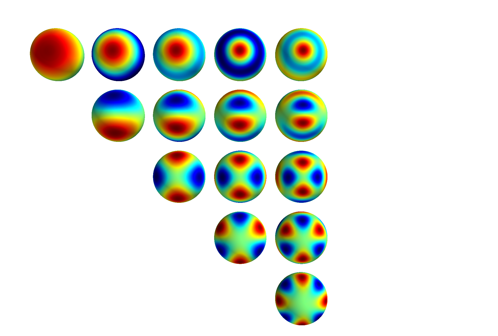
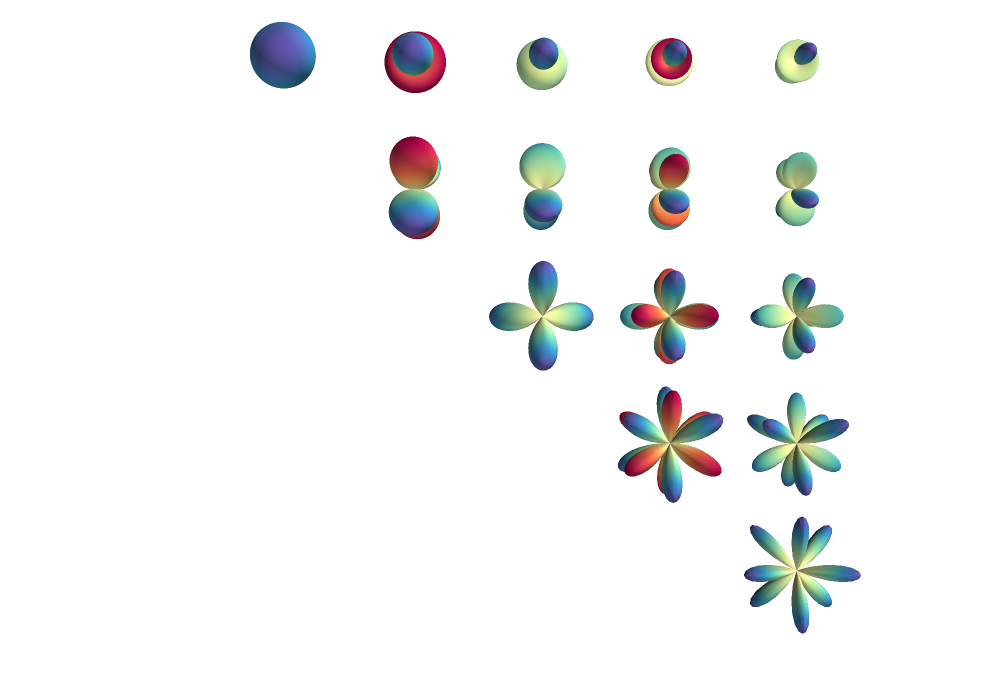

.. include:: macros.rst
Legendre Polynomials
====================

Legendre polynomails are solutions to *Legendre’s differential
equation*,

.. math::

   \label{eq:legendrede}
     \frac{\dif{}}{\dif{x}} \left[ (1-x)^2 \frac{\dif{}}{\dif{x}} P_n(x) \right] + n(n+1) P_n(x) = 0

These are encountered frequently when solving Laplace’s equation in spherical coordinates.
This differential equation can be solved using a power series method.
The equation has regualr singular points at :math:`x=\pm 1`, so solutions only converge in the region :math:`|x|<1`.

When :math:`n` is an integer, the solution :math:`P_n(x)` that is regular at :math:`x=1` is also regular at :math:`x=-1`, and the solution terminates.
These solutions, :math:`P_n`, are called the *Legendre Polynomials*, with each being an :math:`n^{\rm th}`-degree polynomial, expressed by Rodrigues’ Formula:

.. math::

   \label{eq:rodrigues}
     P_n(x) = \frac{1}{2^n\ n!} \frac{\difp{n}{}}{\difp{n}{x}} \left[ (x^1-1)^n \right]

Legendre Polynomials from the Generating Function
-------------------------------------------------

.. glossary::
   Formal Power Series
      A formal power series is a generalisation of the concept of a polynomial, where the number of terms is allowed to be infinite.

A formal power series can be considered in the same way as a normal power series, but we ignore considerations of the convergence by assuming that a variable, :math:`X`, denotes any numerical value.
For example, the series

.. math:: A = 1 - 3X+ 5X^2 - 7X^3 + 9X^4 - 11X^5 + \cdots

As a power series, one property of this series is that it has a radius of convergence equal to 1.
As a formal power series the only relevent information is that the sequence of coefficients,
:math:`[1, -3, 5, -7, 9, -11, \dots]`.
Thus a formal power series merely records the sequence of coefficients.

.. glossary::
   Generating Function
      A generating function is a formal power series in one indeterminate, the coefficients of which encode information about a sequence of numbers, :math:`a_n`, which is indexed by natural numbers.

The Legendre Polynomials can be described by a generating function,
:math:`g(t,x)`,

.. math::

   \label{eq:legendregen}
     g(t,x) = \frac{1}{\sqrt{1- 2xt +t^2}} = \sum^{\infty}_{n=0} P_n(x) t^n

It is then possible to find expressions for the Legendre polynomials by expanding the square root in powers of :math:`t`, and equating coefficients:

.. math::

   \begin{aligned}
     (1-2xt+t^2)^{-\frac{1}{2}} &= 1 + \frac{1}{2}(2xt -t^2)+\frac{3}{8}(2xt-t^2)^2\\&\quad +\frac{5}{16}(2xt-t^2)^3 + \frac{35}{128}(2xt-t^2)^4 \\ &\quad + {\cal O}(t^5)\\
     \text{and,}\quad \sum^{\infty}_{n=0} P_n(x) t^n &= t^0 + xt^1 +
     \frac{1}{2}(3x^2-1)t^2 \\&\quad \frac{1}{2}(5 x^3-3)t^3 +
     \frac{1}{8}(35x^4-30x^2+3)t^4 \\&\quad + {\cal O}(t^5)\end{aligned}

so, by equating the appropriate powers of :math:`t`,

.. math::

   \begin{aligned}
     P_0(x) &= 1 \\
     P_1(x) &= x \\
     P_2(x) &= \frac{1}{2}(3 x^2 - 1) \\
     P_3(x) &= \frac{1}{2}(5 x^3 - 3x) \\
     P_4(x) &= \frac{1}{8}(35 x^4 - 30x^2 + 3)\end{aligned}

Parity of Legendre Polynomials
------------------------------

At :math:`x = \pm 1` the situation is especially simple;

.. math::

   \begin{aligned}
     g(t, \pm 1) &= \frac{1}{\sqrt{1 \mp 2t + t^2}} = \frac{1}{\sqrt{(1 \mp t)^2}} \\
     &= 1 \pm t +t^2 \pm t^3 + \cdots \\
     &= \sum_{n=0}^{\infty} (\pm 1)^n t^n\end{aligned}

 but also

.. math::

   \begin{aligned}
     g(t, \pm 1) &= \sum^{\infty}_{n=0} P_n(\pm 1) t^n \\
     P_n(1) &=1 \\
     P_n(-1)&=(-1)^n =
     \begin{cases}
       +1 & \text{ for } n \text{ even.} \\
       -1 & \text{ for } n \text{ odd.}
     \end{cases}\end{aligned}

 And

.. math::

   \begin{aligned}
     g(-t,-x) &= \frac{1}{\sqrt{1-2(-x)(-t)+(-t)^2}} = \frac{1}{\sqrt{1-2xt+t^2}} \\
     &= g(t,x)\end{aligned}

 Then, equating powers of :math:`t`,

.. math:: P_n(-x) = (-1)^nP_n(x)

Legendre Polynomials and Multipole Expansion
--------------------------------------------

Consider a point charge, :math:`q`, on the :math:`z`-axis, a distance
:math:`a` from the origin. The potential at an arbitrary point
:math:`\vec{r}` will be

.. math::

   \begin{aligned}
     \phi(\vec{r}) &= \frac{1}{4 \pi \epsilon_0} \frac{q}{d} = \frac{1}{4 \pi \epsilon_0} \frac{q}{|\vec{r} - a \hat{e}_z|} \\
                   &= \frac{1}{4 \pi \epsilon_0} \frac{q}{\sqrt{(\vec{r}-a \hat{e}_z)\cdot(\vec{r}-a \hat{e}_z)}}\\
                   &= \frac{1}{4 \pi \epsilon_0} \frac{q}{\sqrt{r^2-2ra \cos \theta + a^2}}\\
                   &= \frac{q}{4 \pi \epsilon_0 r} \qty[  1 - 2 \frac{a}{r} \cos \theta + \qty(\frac{a}{r})^2 ]^{-\frac{1}{2}}\\
                   &= \frac{q}{4 \pi \epsilon_0 r} \sum_{n=0}^{\infty} P_n(\cos \theta)
     \qty( \frac{a}{r})^n
     \end{aligned}

 Adding an extra point charge, :math:`-q` a distance :math:`a` on the
opposite size of the origin gives us

.. math::

   \begin{aligned}
      \phi(\vec{r})  &= \frac{1}{4 \pi \epsilon_0} \frac{q}{d_1} - \frac{1}{4 \pi \epsilon_0} \frac{q}{d_2} \\
                     &= \frac{1}{4 \pi \epsilon_0} \frac{q}{|\vec{r}-a \vec{e}_z|} - \frac{1}{4 \pi \epsilon_0} \frac{q}{|\vec{r}+a \vec{e}_z|} 
   \\                &= \frac{q}{4 \pi \epsilon_0 r} \bigg[ \left(1-2 \frac{a}{r} \cos \theta +\left(\frac{a}{r}\right)^2 \right)^{-\frac{1}{2}} 
   \\                &  \qquad \qquad -  \left(1-2 \frac{a}{r} \cos \theta +\left(\frac{a}{r}\right)^2 \right)^{-\frac{1}{2}} \bigg] 
   \\                &= \frac{q}{4 \pi \epsilon_0 r} \sum_{n=0}^{\infty} \qty( P_n(\cos\theta) \qty( \frac{a}{r} )^n - P_n(\cos \theta) \qty( \frac{-a}{r})^n )
   \\                &= \frac{2q}{4 \pi \epsilon_0 r} \qty( P_1 (\cos \theta) \frac{a}{r} + P_3 (\cos \theta) \qty(\frac{a}{r})^3 + \cdots )
       \end{aligned}

 so, only odd powers survive, and, for large enough :math:`r`,

.. math::

   \phi(\vec{r}) \approx \frac{2qa}{4 \pi \epsilon_0 r^2}
       P_1(\cos\theta)

 This is the potential from an electric dipole, and :math:`2qa` is the
dipole moment. The leading term in an expansion describes the
distribution:

.. math::

   \begin{aligned}
         \frac{1}{r} P_0 (\cos \theta) \left(\frac{a}{r}\right)^0 &= \frac{1}{r} & \text{(Monopole)} \\
         \frac{1}{r} P_1 (\cos \theta) \left(\frac{a}{r}\right)^1 &= \frac{a}{r^2} \cos \theta & \text{(Dipole)} \\
         \frac{1}{r} P_2 (\cos \theta) \left(\frac{a}{r}\right)^2 &= \frac{a^2}{2r^3} (3\cos^2 \theta - 1) & \text{(Quadrupole)} \\
         \frac{1}{r} P_3 (\cos \theta) \left(\frac{a}{r}\right)^3 &= \frac{a^3}{2r^4} (5\cos^3 \theta - 3 \cos \theta) & \text{(Octupole)} \\
       \end{aligned}

Recurrence Relations for Legendre Polynomials
---------------------------------------------

We can derive recurrence relations for the Legendre polynomials starting
by taking the derivative of the generating function, equation
([eq:legendregen]).

.. math::

   \begin{aligned}
         \frac{\partial g(t,x)}{\partial t} &= \frac{x-t}{(1-2xt+t^2)^{\frac{3}{2}}} = \sum_{n=0}^{\infty} P_n(x)nt^{n-1} \\
         &= \frac{x-t}{(1-2xt+t^2)}\frac{1}{\sqrt{1-2xt+t^2}} \\
         &= \frac{x-t}{1-2xt+t^2} \sum_{n=0}^{\infty}P_n(x) t^n \\
       \end{aligned}

 Thus

.. math::

   \begin{aligned}
         (1-2xt+t^2) \sum_{n=0}^{\infty} P_n(x) nt^{n-1} &= (x-t)
         \sum_{n=0}^{\infty} P_n(x) t^n
       \end{aligned}

 expanding,

.. math::

   \begin{aligned}
         \sum_{n=0}^{\infty} P_n(x) nt^{n-1} &- sx \sum_{n=0}^{\infty} P_n(x) nt^n + \sum_{n=0}^{\infty} P_n(x) nt^{n+1} \\
         &= x \sum_{n=0}^{\infty} P_n(x)t^n - \sum_{n=0}^{\infty} P_n(x)
         t^{n+1}
       \end{aligned}

 Then, relabelling,

.. math::

   \begin{aligned}
         \sum_{n=-1}^{\infty} P_{n+1}(x)(n+1) &- 2x \sum_{n=0}^{\infty} P_n(x) nt^n + \sum_{n=1}^{\infty} P_{n-1}(x)(n-1) \\
         &= x \sum_{n=0}^{\infty} P_n(x) t^n - \sum_{n=1}^{\infty}
         P_{n-1}(x) t^n
       \end{aligned}

 Equating powers of :math:`t^n` for :math:`n \ge 1`,

.. math::

   P_{n+1}(x)(n+1) - 2x P_n(x)n + P_{n-1}(x)(n-1) = xP_n(x) -
       P_{n-1}(x)

 Thus

.. math::

   (2n+1) x P_n(x) = (n+1) P_{n+1}(x) + nP_{n-1}(x) \qquad (n \ge
       1)

 This recurrence relation allows the calculation of Lengendre
polynomials using a recursive function. Taking the derivative with
respect to :math:`x` instead,

.. math::

   \begin{aligned}
     \frac{\partial g(t,x)}{\partial x} &= \frac{t}{(1-2xt +t^2)^{\frac{3}{2}}} \\
     &= \sum_{n=0}^{\infty} P^{\prime}_n(x)t^n \\
     &= \frac{t}{1-2xt+t^2} \frac{1}{\sqrt{1-2xt+t^2}} \\
     &= \frac{t}{1-2xt+t^2} \sum_{n=0}^{\infty} P_n(x) t^n \\
     (1-2xt+t^2) \sum_{n=0}^{\infty} P^{\prime}_n(x)t^n &= t
     \sum_{n=0}^{\infty} P_n(x) t^n\end{aligned}

.. math::

   P^{\prime}_{n+1}(x) + P^{\prime}_{n-1}(x) = 2x P_n^{\prime}(x) +
   P_n(x)

Orthogonality and Completeness of the Legendre Polynomials
----------------------------------------------------------

It is possible to show that the Legendre Polynomials are orthogonal by
considering the Legendre equation, equation ([eq:legendrede]).

.. math::

   \begin{aligned}
     P_m(x) & \textcolor{accent-red}{\frac{\dif{}}{\dif{x}} \left[ (1-x^2) \frac{\dif{}}{\dif{x}}P_n(x)\right]} - P_n(x) \textcolor{accent-blue}{\frac{\dif{}}{\dif{x}}\left[ (1-x^2) \frac{\dif{}}{\dif{x}}P_m(x) \right]} \\
     &= - P_m(x) \textcolor{accent-red}{n(n+1)P_n(x)}+P_n(x)
     \textcolor{accent-blue}{m(m+1)P_m(x)}\end{aligned}

 Now, integrating :math:`x` over the range :math:`[-1, 1]`,

.. math::

   \begin{aligned}
     \int_{-1}^1& \textcolor{accent-blue}{P_m(x)} \frac{\dif{}}{\dif{x}}
     \left[ \textcolor{accent-red}{(1-x^2) \frac{\dif{}}{\dif{x}} P_n(x)}
     \right] \dif{x} \\= & \underbrace{\left[
         \textcolor{accent-blue}{P_m(x)} \textcolor{accent-red}{(1-x)^2
           \frac{\dif{}}{\dif{x}}P_n(x)} \right]^1_{-1}}_{= 0} \\ &-
     \underbrace{\int_{-1}^1 \left[ \frac{\dif{}}{\dif{x}}
         \textcolor{accent-blue}{P_m(x)}\textcolor{accent-red}{(1-x^2)
           \frac{\dif{}}{\dif{x}} P_n(x)} \right]
       \dif{x}}_{\text{symmetric in n,m}} \\0 & = [m(m+1) - n(n+1)]
     \int_{-1}^1 P_n(x) P_m(x) \dif{x}\end{aligned}

 Then, for :math:`n \neq m`,

.. math:: \int_{-1}^1 P_n(x) P_m(x) \dif{x} = 0

 So Legendre polynomials are orthogonal over the region
:math:`x \in [-1, 1]` When :math:`n=m`, we return to the generating
function,

.. math::

   \sum_{n=0}^{\infty} P_n(x)t^n \sum_{m=0}^{\infty} P_m(x)t^m =
   \frac{1}{1-2xt+t^2}

 Integrating over :math:`x`,

.. math::

   \begin{aligned}
     \int_{-1}^1 \frac{1}{1-2xt+t^2} \dif{x} &= \left[ - \frac{1}{2t}
       \log (1-2xt+t^2) \right]^1_{-1} \\ &= \frac{1}{t} \log \left(
       \frac{1+t}{1-t} \right) \\ &= 2 \sum_{n=1}^{\infty}
     \frac{t^{2n}}{2n+1}\end{aligned}

.. math::

   \begin{aligned}
     \int_{-1}^1 \sum_{n=0}^{\infty} P_n(x)t^n \sum_{m=0}^{\infty} P_m(x)
     t^m \dif{x} &= \sum_{n=0}^{\infty} \int_{-1}^1 [P_n(x)]^2 t^{2n}
     \dif{x}\end{aligned}

and equating powers of :math:`t`,

.. math::

   \begin{aligned}
     \int_{-1}^1 [P_n(x)]^2 \dif{x} = \frac{2}{2n + 1}\end{aligned}

 And putting these relations together we get an orthogonality and
normalisation condition

.. math::

   \label{eq:orthonormlegend}
     \int_{-1}^1 P_n(x) P_m(x) \dif{x} = \frac{2}{2n+1} \delta_{nm}

 Legendre polynomials are also complete—any continuous function can be
expressed as an infinite sum of Legendre polynomials in :math:`x \in
[-1,1]`. Taking a function :math:`f(x)`, then

.. math::

   \label{eq:legendreseries}
     f(x) = \sum_{n=0}^{\infty} c_n P_n(x)

 Then,

.. math::

   \begin{aligned}
     \int_{-1}^1 f(x) P_m(x) \dif{x} &= \sum_{n=0}^{\infty} c_n
     \int_{-1}^1 P_n(x) P_m(x) \dif{x} \\ &= \sum_{n=0}^{\infty} c_n
     \frac{2}{2m+1} \delta_{nm} \\ &= c_m \frac{2}{2m+1}\end{aligned}

 So,

.. math::

   \label{eq:legendreseriesoffunc}
     f(x) = \sum_{n=0}^{\infty} \left( n + \frac{1}{2} \right) \left( \int_{-1}^1 f(y) P_n(y) \dif{y} \right) P_n(x)

| *Expanding the step function as a series of Legendre polynomials.*

[scale=1.0]

[width=, height=2in, xmin=-1, xmax=1, samples=50] gnuplot[raw gnuplot,
id=leg1, mark=none, domain=-1:1, muted-blue, ultra thick] set xrange
[-1:1]; step(x) = (x>0) ? 1 : 0; plot step(x); ;

| 
| We have the definition of a Legendre series from equation
  ([eq:legendreseriesoffunc]) as

  .. math:: f(x) = \sum_l c_l P_l(x)

   then

  .. math::

     \begin{aligned}
     \int_{-1}^1 f(x) P_m(x) \dd{x} &= \sum_{l=0}^{\infty} c_l \int_{-1}^1 P_l(x) P_m(x) \dd{x} \\&= c_m \frac{2}{2m+1}\end{aligned}

   and so

  .. math:: c_l = \frac{2l+1}{2} \int_{-1}^1 f(x) P_l(x) \dd{x}

   now

  .. math::

     \begin{aligned}
         c_0 &= \frac{1}{2} \int_0^1 P_0(x) \dd{x} = \frac{1}{2} \\
         c_1 &= \frac{3}{2} \int_0^1 P_1(x) \dd{x} = \frac{3}{4} \\
       \end{aligned}

   and so

  .. math:: f(x) = \frac{1}{2} P_0(x) + \frac{3}{4} P_1(x) - \frac{7}{16} P_3(x) + \frac{11}{32} P_5(x) + \cdots

[scale=1.0]

[width=, height=2in, xmin=-1, xmax=1, samples=50] gnuplot[raw gnuplot,
id=leg1, mark=none, domain=-1:1, muted-orange, ultra thick] set xrange
[-1:1]; leg(n,x) = (n==0) ? 1 : (n==1) ? x : ((2\*n+1)\*x\*leg(n-1, x) -
n\*leg(n-2, x))/(n+1); plot (
0.5\*leg(0,x)+0.75\*leg(1,x)-(0.4375)\*leg(3,x)+(0.34375)\*leg(5,x) ); ;

Associated Legendre Polynomials
===============================

Associated Legendre polynomials are obtained by differentiating a
standard Legendre polynomial :math:`m` times, with respect to :math:`x`.

.. math::

   \label{eq:definitionassocleg}
     P_n^m(x) = (1-x^2)^{\frac{m}{2}} \frac{\dif{}^m}{\dif{x}^m} P_n(x)

 these are solutions of the associate Legendre equation,

.. math::

   \label{eq:assoclegendrede}
     \frac{\dif{}}{\dif{x}} \left[ (1-x^2) \frac{\dif{P_n^m(x)}}{\dif{x}} \right] + n(n+1)P_n^m(x) - \frac{m^2}{1-x^2} P_n^m(x) = 0

Then,

.. math:: P_0(x) = 1 \therefore P_0^0(x) = 1

.. math:: P_1(x) = x \therefore P_1^0(x) = x

.. math:: P_1^1(x) = (1-x^2)^{\frac{1}{2}}

There are different conventions for negative values of :math:`m`, but
since the only dependence on :math:`m` is an :math:`m^2` term, we can
take them to be equal. If :math:`x = \cos (\theta)`,

.. math:: P_1^0(x) = \cos(\theta)

.. math:: P_1^{\pm 1} = \sin(\theta)

 The associated Legendre polynomials are also orthogonal,

.. math::

   \label{eq:orthogonalityassoclag}
     \int_{-1}^1 P_l^m(x) P_n^m(x) \dd{x} = \frac{(l+m)!}{(l-m)!} \frac{2}{2l+1} \delta_{ln}

Spherical Harmonics
-------------------

Spherical harmonics are a class of function related to the associated
Legendre polynomials by the expression

.. math::

   \label{eq:spharmonicdef}
     Y_{lm}(\theta, \phi) = \qty[ \frac{2l+1}{4 \pi} \frac{(l-|m|)!}{(l+|m|)!}]^{\frac{1}{2}} P_l^m (\cos(\theta)) e^{im\phi}

Spherical harmonics with a negative :math:`m` value can be related to
those with a positive :math:`m` value via

.. math::

   \label{eq:negativespharm}
     Y_{l, -m} (\theta, \phi) = (-1)^m Y^{*}_{lm} (\theta, \phi)

 and they are orthogonal,

.. math::

   \label{eq:spahrmorthog}
     \int \dd{\Omega} Y^{*}_{lm} (\theta, \phi) Y_{l^{\prime}m^{\prime}}(\theta, \phi) = \delta_{l l^{\prime}} \delta_{m, m^{\prime}}

 The first few spherical harmonics are

.. math:: Y_{00} = \sqrt{\frac{1}{4 \pi}}

.. math:: Y_{10}= \sqrt{\frac{3}{4 \pi}} \cos(\theta)

.. math:: Y_{1, \pm 1} = \mp \sqrt{\frac{3}{8 \pi}} \sin(\theta) e^{\pm i \phi}

Spherical Harmonics and the Schrodinger Equation
------------------------------------------------

In spherical coordinates the time-independent Schrodinger equation is

.. math::

   \label{eq:tisespherical}
     \begin{split}
     - \frac{\hbar^2}{2m} \frac{1}{r^2 \sin^2 \theta} \bigg( \pdv{r} \qty[ r^2 \sin(\theta) \pdv{\psi}{r}] 
   + \pdv{\theta} \qty[ \sin \theta  \pdv{\psi}{\theta}] \\ + \pdv{\phi} \qty[ \frac{1}{\sin \theta} \pdv{\psi}{\phi}] \bigg) 
   + (V-E)\psi = 0
   \end{split}

 Now, splitting this into the radial part and an angular part,

.. math::

   \label{eq:sepschrod}
     \psi(r, \theta, \phi) = R(r) Y(\theta, \phi)

 Then, substituting this in, and setting both sides of the equation
equal to :math:`l(l+1)` we get two independent solutions

.. math::

   \begin{aligned}
     \dv{r} \qty[r^2 \dv[2]{R}{r}] - \frac{2m}{\hbar^2} \qty(V(r)-E) r^2
     R - l(l+1) R &= 0 \\\frac{1}{\sin \theta} \pdv{\theta} \qty[ \sin
     \theta \pdv{Y}{\theta}] + \frac{1}{\sin^2(\theta)}
     \pdv[2]{Y}{\phi} +l(l+1)Y &= 0\end{aligned}

 The angular part is solved by spherical harmonics,

.. math::

   \label{eq:sphericalharmonics}
     Y_l^m(\theta, \phi) = N e^{im\phi} P_l^m (\cos \theta)

Bessel Functions
================

Bessel functions are the solutions to Bessel’s differential equation,

.. math::

   \label{eq:besselde}
     x^2 \dv[2]{y}{x} + x \dv{y}{x} + (x^2 - \alpha^2)y = 0

 with :math:`p` a constant.

Bessel functions from the Generating Function
---------------------------------------------

The Bessel functions can be described by a generating function,

.. math::

   \label{eq:besselgen}
     g(x,t) = \exp(\frac{x}{2t}(t^2-1)) = \sum_{\nu=-\infty}^{\infty} J_{\nu}(x) t^{\nu}

So, for Bessel functions of integer order we can expand this to form a
series expansion,

.. math::

   \label{eq:besselseriesexp}
     J_n(x) = \sum^{\infty}_{s=0} \frac{(-1)^s}{s! (n+s)!} \qty( \frac{x}{2} )^{n+2s} \approx \frac{x^n}{2^n n!}

 for small :math:`x`.

Bessel functions with a negative index can be found from the relation

.. math::

   \label{eq:negativebessel}
     J_{-\nu}(x) = (-1)^{\nu} J_{\nu}(x)

[ width=, height=2in, xmin=0, xmax=20, ] gnuplot[raw gnuplot, id=bess,
mark=none, muted-blue, ultra thick] set xrange[0:20]; plot besj0(x); ;
gnuplot[raw gnuplot, id=bess2, mark=none, muted-green, ultra thick] set
xrange[0:20]; plot besj1(x); ; gnuplot[raw gnuplot, id=bess3, mark=none,
muted-orange, ultra thick] set xrange[0:20]; fac(n) = (int(n)==0) ? 1.0
: int(n) \* fac(int(n)-1.0); besj\_eps = 0.1; besj(n,x) = (n==0) ?
besj0(x) : (n==1) ? besj1(x) : (abs(x)<besj\_eps\*(n+1)) ?
(x/2.0)\*\*n/fac(n) : 2\*(n-1)/x\*besj(n-1,x) - besj(n-2,x); plot
besj(2,x); ; gnuplot[raw gnuplot, id=bess4, mark=none, accent-purple,
ultra thick] set xrange[0:20]; fac(n) = (int(n)==0) ? 1.0 : int(n) \*
fac(int(n)-1.0); besj\_eps = 0.1; besj(n,x) = (n==0) ? besj0(x) : (n==1)
? besj1(x) : (abs(x)<besj\_eps\*(n+1)) ? (x/2.0)\*\*n/fac(n) :
2\*(n-1)/x\*besj(n-1,x) - besj(n-2,x); plot besj(3,x); ; gnuplot[raw
gnuplot, id=bess5, mark=none, accent-red, ultra thick] set xrange[0:20];
fac(n) = (int(n)==0) ? 1.0 : int(n) \* fac(int(n)-1.0); besj\_eps = 0.1;
besj(n,x) = (n==0) ? besj0(x) : (n==1) ? besj1(x) :
(abs(x)<besj\_eps\*(n+1)) ? (x/2.0)\*\*n/fac(n) :
2\*(n-1)/x\*besj(n-1,x) - besj(n-2,x); plot besj(4,x); ;

Recurrence Relation for Bessel Functions
----------------------------------------

The Bessel functions can be descried by a pair of recurrence relations,
found by differentiating with respect to :math:`t`,

.. math::

   \label{eq:recurrencebessel}
     J_{\nu-1}(x) + J_{\nu+1}(x) = \frac{2 \nu}{x} J_{\nu}(x)

and by differentiating with respect to :math:`x`,

.. math::

   \label{eq:recurrencebessel2}
     J_{\nu-1}(x) - J_{\nu+1}(x) = 2J_{\nu}^{\prime}(x)

A number of other integral relationships also exist.

.. math::

   \begin{aligned}
     \int x^n J_{n-1}(x) \dd{x} &= x^n J_n(x) \\
     \int x^{-n} J_{n+1}(x) \dd{x} &= -x^{-n} J_n(x) \\
     \int J_1(x) \dd{x} &= -J_0(x)\end{aligned}

Orthogonality of the Bessel Functions
-------------------------------------

The orthogonality relations for Bessel functions are similar to those of
the trigonometric functions, but they include an additional weighting
factor, :math:`r`.

.. math::

   \label{eq:orthogbess}
     \int_0^a r J_p \qty( \frac{\alpha r}{a} ) J_p \qty(\frac{\beta r}{a}) \dd{r} = \delta_{\alpha \beta} \frac{a^2}{2} J_{p+1}^2(\alpha)

with

.. math::

   \begin{aligned}
     J_p(\alpha) = J_p(\beta) = 0\end{aligned}

Bessel Series
-------------

The orthogonality relations for Bessel functions allow the definition of
Bessel series,

.. math::

   \label{eq:besselser}
     f(x) = \sum_0^{\infty} c_n J_p(k_n x)

 with :math:`J_p(k_na)=0`.

| *Deriving the steady state inside an infinite cyclinder with the
  curved sides kept at a temperature :math:`T_0`, and the base at
  :math:`T_1`.*
| We know :math:`\nabla^2 T =0`, and we can use seperation of variables
  to give a solution of the form :math:`T = R(r)\Theta(\theta)Z(z)`.
  Then, in cylinderical coordinates,

  .. math:: \frac{1}{R}\frac{1}{r} \dv{r} \qty(r \dv{R}{r}) + \frac{1}{\Theta} \frac{1}{r^2} \dv[2]{\Theta}{\theta} + \frac{1}{Z} \dv[2]{Z}{z} = 0

   We now have

  .. math:: \frac{1}{Z} \dv[2]{Z}{z} = k^2

   implying

  .. math:: Z = \exp(\pm kz)

   also,

  .. math:: \frac{1}{R}\frac{1}{r} \dv{r} \qty(r \dv{R}{r}) + \frac{1}{\Theta} \frac{1}{r^2} \dv[2]{\Theta}{\theta} + k^2 = 0

   which we can multiply by :math:`r^2`,

  .. math:: \frac{r}{R} \dv{r} \qty(r \dv{R}{r}) + \frac{1}{\Theta} \dv[2]{\Theta}{\theta} + k^2 r^2 = 0

   from which,

  .. math:: \frac{1}{\Theta} \dv[2]{\Theta}{\theta} = -n^2

   implying that

  .. math:: \Theta = \{ \cos(n \theta), \sin(n \theta) \}

   and the periodicity of :math:`\theta` will force :math:`n` to be a
  natural number. Then

  .. math:: \frac{r}{R} \dv{r} \qty(r \dv{R}{r}) + (k^2 r^2 - n^2) = 0

   and letting :math:`kr = s`,

  .. math:: s \dv{s} \qty( s \dv{R}{s} ) + (s^2 - n^2)R = 0

   which has the form of Bessel’s differential equation, equation
  ([eq:besselde]), and thus the solutions are Bessel functions,
  :math:`J_n(s)`, the complete solution is thus

  .. math:: J_n (kr) \qty( A \sin(n\theta) + B \cos(n \theta) ) e^{-kz}

   We can ignore the Bessel functions which are infinite at :math:`r=0`,
  as we need a finite solution there, so the first-order functions are
  the appropriate solutions. We know that :math:`T_1 > T_0`, so
  :math:`T>T_0` everywhere, and so :math:`T_0` can be taken as a
  constant. The boundary condition of the curved surface at :math:`r=a`
  is where :math:`J_n(ka) = 0`. We now need to know the zeros of the
  Bessel functions, and our solution becomes

  .. math:: T = T_0 + \sum_{m=0}^{\infty} c_m J_0 \qty(\alpha_{0m}\frac{r}{a}) \exp(-\qty(\frac{\alpha_{0m}z}{a}))

   The boundary condition at :math:`z=0` is that :math:`T=T_0`, so

  .. math:: T_1 - T_0 = \sum_m c_m J_0 \qty( \alpha_{0m} \frac{r}{a})

   and using the orthogonality condition,

  .. math:: \int_0^a (T_1 - T_0) J_0 \qty( \alpha_{0m} \frac{r}{a} ) r \dd{r} = c_m \frac{a^2}{2} J_1^2(\alpha_{0m})

   and then, from the indefinite integral relationship
  :math:`\int x J_0(x) \dd{x} = x J_1(x)`,

  .. math::

     \begin{aligned}
     (T_1-T_0) \frac{a}{\alpha_{0m}} \qty[ r J_1 \qty( \alpha_{0m} \frac{r}{a})]_0^a &= (T_1 - T_0) \frac{a^2}{\alpha_{0m}} J_1 (\alpha_{0m})\\
     &= c_m \frac{a^2}{2} J_1^2 (\alpha_{0m})\end{aligned}

   with

  .. math:: c_m = \frac{2}{\alpha_{0m}} \frac{1}{J_1(\alpha_{0m}} (T_1-T_0)

   and the overarching solution is thus

  .. math:: T = T_0 + \sum_m \frac{2 (T_1-T_0)}{\alpha_{0m}J_1(\alpha_{0m})} J_0 \qty( \alpha_{0m} \frac{r}{a}) \exp( - \qty(\frac{\alpha_{0m}z}{a}) )

Spherical Bessel Functions
--------------------------

The spherical Bessel functions are a class of Bessel function related to
the half-integer order order Bessel functions by

.. math::

   \label{eq:sphericalbess}
     j_n(x) = \sqrt{\frac{\pi}{2x}} J_{n+\frac{1}{2}}(x) = x^n \qty(- \frac{1}{x} \dv{x})^n \frac{\sin(x)}{x}

| *Finding energy levels of particles inside a spherical box using
  Schrodinger’s equation.*
| Starting at

  .. math:: - \frac{\hbar^2}{2m} \nabla^2 \Psi = E \Psi

   after seperating variables

  .. math:: \pdv{r} \qty(r^2 \pdv{R}{r}) + \qty( \frac{2mEr^2}{\hbar^2} - l(l+1) )R=0

   letting

  .. math:: k^2 = \frac{2mE}{\hbar^2} \quad \text{and} \quad s=kr

  .. math:: s^2 \pdv[2]{R}{s} + 2s \pdv{R}{s} + \qty(s^2 - l(l+1))R = 0

   and letting

  .. math:: R = \frac{Z}{s^{\frac{1}{2}}}

  .. math:: s^2Z^{\prime \prime} + s Z^{\prime} + (s^2 - \qty(l + \frac{1}{2})^2 ) Z = 0

   Which is Bessel’s equation of order :math:`l+\half`, so

  .. math:: R = j_l \qty( \frac{\sqrt{2mE}}{\hbar} r)

   which is a finite solution as :math:`r \to 0`. The lowest energy
  state will have :math:`l=0` (so no angular variation), and to satisy
  the boundary condition of :math:`R=0` when :math:`r=a`, we need

  .. math:: j_0 \qty( \frac{\sqrt{2mE}}{\hbar}a)=0

   the zeros of :math:`j_0` are the same as those of :math:`\sin(x)`,
  since

  .. math:: j_0(x) = \frac{\sin(x)}{x}

   so

  .. math:: \frac{a \sqrt{2mE_{\rm min}}}{\hbar} = \pi

   thus

  .. math:: E_{\rm min} = \frac{\pi^2 \hbar^2}{2ma^2}

Hermite Polynomials
===================

[ width=, height=2in, xmin=-3, xmax=3, ymin=-60, ymax=50, ] gnuplot[raw
gnuplot, id=bess, mark=none, muted-blue, ultra thick] set xrange[-3:3];
set yrange[-40:50]; herm(n,x) = (n==0) ? 1 : (n==1) ? 2\*x :
2\*x\*herm(n-1,x)-2\*n\*herm(n-2,x); plot herm(0,x); ; gnuplot[raw
gnuplot, id=bess2, mark=none, muted-green, ultra thick] set
xrange[-3:3]; set yrange[-40:50]; herm(n,x) = (n==0) ? 1 : (n==1) ? 2\*x
: 2\*x\*herm(n-1,x)-2\*n\*herm(n-2,x); plot herm(1,x); ; gnuplot[raw
gnuplot, id=bess3, mark=none, muted-orange, ultra thick] set
xrange[-3:3]; set yrange[-40:50]; herm(n,x) = (n==0) ? 1 : (n==1) ? 2\*x
: 2\*x\*herm(n-1,x)-2\*n\*herm(n-2,x); plot herm(2,x); ; gnuplot[raw
gnuplot, id=bess4, mark=none, accent-purple, ultra thick] set
xrange[-3:3]; set yrange[-40:50]; herm(n,x) = (n==0) ? 1 : (n==1) ? 2\*x
: 2\*x\*herm(n-1,x)-2\*n\*herm(n-2,x); plot herm(3,x); ; gnuplot[raw
gnuplot, id=bess5, mark=none, accent-red, ultra thick] set xrange[-3:3];
set yrange[-40:50]; herm(n,x) = (n==0) ? 1 : (n==1) ? 2\*x :
2\*x\*herm(n-1,x)-2\*n\*herm(n-2,x); plot herm(4,x); ;

Hermite polynomials are the solutions to the hermite equation,

.. math::

   \label{eq:hermitede}
     \dv[2]{y}{x} - 2x \dv{y}{x} + 2n y = 0

 Hermite polynomials are solutions to the radial part of the Schrodinger
equation for the simple harmonic oscillator. Just like Legendre
polynomials and Bessel functions we can define Hermite polynomials,
:math:`H_n (x)` via a generating function:

.. math::

   \label{eq:hermite}
     g(x,t) = e^{-t^2 + 2tx} = \sum^\infty_{n=0} H_n(x) \frac{t^n}{n!}

Recurrence Relations for Hermite polynomials
--------------------------------------------

First we diferentiate with respect to :math:`t`,

.. math::

   \frac{\partial}{\partial t} g(x,t) = (-2t+2x) e^{-t^2+2tx} =
   \sum^{\infty}_{n=1} H_n(x) \frac{t^{n-1}}{n!}

Expanding, and putting into the generating function again,

.. math::

   -2 \sum^{\infty}_{n=0} H_n(x) \frac{t^{n+1}}{n!} + 2x
   \sum^{\infty}_{n=0} H_n(x) \frac{t^n}{n!} = \sum^{\infty}_{n=1}
   H_n(x)\frac{t^{n-1}}{(n-1)!}

 Relabelling the indices,

.. math::

   -2 \sum^{\infty}_{n=1} nH_{n-1}(x) \frac{t^{n}}{n!} + 2x
   \sum^{\infty}_{n=0} H_n(x) \frac{t^n}{n!} = \sum^{\infty}_{n=1}
   H_{n+1}(x)\frac{t^n}{n!}

 and finally equating coefficients of :math:`t^n`,

.. math::

   \label{eq:recurrencehermite}
     H_{n+1}(x) = 2x H_n(x) - 2n H_{n-1}(x) \qquad (n \ge 1)

 If we instead differentiate with respect to :math:`x`,

.. math:: \pdv{x}g(x,t) = 2t e^{-t^2+2tx} = \sum_{n=0}^{\infty} H^{\prime}_n(x) \frac{t^n}{n!}

 and substitute in :math:`g`,

.. math:: 2 \sum_{n=0}^{\infty} H_n(x) \frac{t^{n+1}}{n!} = \sum_{n=1}^{\infty} H^{\prime}_n(x) \frac{t^n}{n!}

 and relabelling,

.. math:: 2 \sum_{n=1}^{\infty} H_{n-1}(x) \frac{t^{n}}{(n-1)!} = \sum_{n=1}^{\infty} H^{\prime}_n(x) \frac{t^n}{n!}

 and then equating coeffients of :math:`t^n`,

.. math::

   \label{eq:recurrencehermite2}
     H_n^{\prime}(x) = 2n H_{n-1}(x)

 These can be used to derive the ordinary differential equation which
motivates these polynomials, from the previous results we can find

.. math:: H_{n+1}(x) = 2x H_n(x) - H^{\prime}_n(x)

 and then differentiate with respect to :math:`x`,

.. math::

   \begin{aligned}
     H^{\prime}_{n+1}(x) &= 2 H_n(x) + 2x H^{\prime}_n(x) - H^{\prime \prime}_n(x) \\
     2(n+1)H_{n}(x) &= 2 H_n(x) + 2x H^{\prime}_n(x) - H^{\prime \prime}_n(x) \end{aligned}

 and so

.. math:: \dv[2]{H_n(x)}{x} - 2x \dv{H_n(x)} + 2n H_n(x) = 0

It is possible to use the recurrence relations to find the Hermite
polynomials, so

.. math::

   \begin{aligned}
     H_0(x) &=  1 \\
     H_1(x) &=  2x \\
     H_2(x) &=  4x^2 - 2 \\
     H_3(x) &=  8x^3 - 12x \\
     H_4(x) &=  16x^4 - 48x^2 + 12\end{aligned}

Properties of the Hermite Polynomials
-------------------------------------

The Hermite polynomials are symmetric about :math:`x=0`, so

.. math::

   \label{eq:parityhermite}
     H_n(-x) = (-1)^n H_n(x)

The Hermite polynomials can be described by a specific series of the
form

.. math::

   \label{eq:hermiteseriesspef}
     H_n(x) = \sum_{m=0}^{\frac{n}{2}}(-1)^m (2x)^{n-2m} \frac{n!}{(n-2m)!m!}

And Rodrigues’s equation for Hermite polynomials also exists *proof is
an exercise*

.. math::

   \label{eq:rodrigueshermite}
     H_n(x) = (-1)^n e^{x^2} \dv[n]{x} \qty(e^{-x^2})

Orthogonality of Hermite Polynomials
------------------------------------

It is possible to show the orthogonality of the Hermite polynomials.
Starting at Hermite’s equation,

.. math::

   \begin{aligned}
     H_n^{\prime \prime}(x) - 2x H^\prime_n (x) + 2n H_n (x) &= 0 \\
   \dv{x} \qty( e^{-x^2} \dv{x} H_n (x) ) + 2n e^{-x^2} H_n(x) &=0 \end{aligned}

 then, proceeding in much the same way as with Legendre polynomials in
section [sec:orthogonallegendre],

.. math::

   \begin{aligned}
   \begin{split}
     H_m(x) \dv{x} \qty[ e^{-x^2} \dv{x} H_n(x) ] - H_n(x) \dv{x} \qty[ e^{-x^2} \dv{x} H_m(x)] \\= -H_m(x) \cdot 2 n e^{-x^2} H_n(x) + H_n(x) \cdot 2 m e^{-x^2} H_m(x) 
   \end{split}\end{aligned}

.. math::

   \begin{aligned}
   \begin{split}
   \int_{-\infty}^{\infty} H_m(x) \dv{x} \qty[ e^{-x^2} \dv{x} H_n(x)] \dd{x} \\= \qty[ H_m(x) e^{-x^2} \dv{x} H_n(x)]_{-\infty}^{\infty} - \int_{-\infty}^{\infty} \qty[ \dv{x} H_m(x)] e^{-x^2} \dv{x} H_n(x) \dd{x}
   \end{split}\end{aligned}

.. math::

   \begin{aligned}
     2(m-n) \int_{-\infty}^{\infty} H_n(x) H_m(x) e^{-x^2} \dd{x} &= 0 \\
   \therefore \int_{-\infty}^{\infty} H_n(x) H_m(x) e^{-x^2} \dd{x} &= 0 \text{ iff } n \neq m\end{aligned}

 Hermite polynomials are orthogonal on the interval
:math:`[-\infty, \infty]` with a weighting of :math:`\exp(-x^2)`.

.. math::

   \begin{aligned}
     \int_{-\infty}^{\infty} g^2(x,t) e^{(-x^2)} \dd{x} &= \int_{-\infty}^{\infty} \exp(-2t^2+4tx-x^2) \dd{x} \\
   &= \sum_{n=0}^{\infty} \sum_{m=0}^{\infty} \frac{t^{n+m}}{n! m!} \int_{-\infty}^{\infty} H_n(x) H_m(x) e^{(-x^2)} \dd{x} \\
   &= e^{2t^2}\int_{-\infty}^{\infty} e^{-x^2} \dd{x}\\
   &= e^{2t^2} \sqrt{\pi} \\
   &= \sqrt{\pi} \sum_{n=0}^{\infty} \frac{2^n}{n!} t^{2n}\end{aligned}

 Finally, equating powers of :math:`t^{2n}` gives

.. math:: \int_{-\infty}^{\infty} \qty[ H_n(x)]^2 \exp(-x^2) = 2^n \sqrt{\pi} n!

 so,

.. math::

   \label{eq:hermiteorthoweight}
   \int_{-\infty}^{\infty} H_n(x) H_m(x) \exp(-x^2) \dd{x} = 2^n \sqrt{\pi} n! \delta_{nm}

 it is also possible to remove the weighting by redefining the
polynomial as

.. math:: \phi_n(x) := \exp(-x^2) H_n(x)

 in this case

.. math::

   \label{eq:hermiteorthonoweight}
     \int_{-\infty}^{\infty} \phi_n(x) \phi_m(x) \dd{x} = 2^n \sqrt{\pi} n! \delta_{nm}

 these, however, are solutions not of Hermite’s equation, but of a
slightly variant equation,

.. math::

   \label{eq:modhermiteequation}
     \phi^{\prime \prime}_n(x) + (1-x^2+2n) \phi_n(x) = 0

The Quantum Harmonic Oscillator
-------------------------------

Returning to the one-dimensional time-independent Schrödinger equation,

.. math::

   \label{eq:1}
     - \frac{\hbar^2}{2m} \dv[2]{x} \psi(x) + V(x) \psi(x) = E \psi(x)

 with :math:`m` the mass of the particle, and :math:`E` its energy. For
the simple harmonic oscillator,

.. math:: V(x) \half m \omega^2 x^2

 so

.. math::

   \psi^{\prime \prime} (x) + \qty( - \frac{m^2 \omega^2}{\hbar^2} x^2
   + \frac{2m E}{\hbar^2} ) \psi(x) = 0

 which has a form very similar to the modified Hermite equation of the
previous section, and these describe the quantum harmonic oscillator.

Let :math:`y = ax` with :math:`a = \sqrt{\frac{m \omega}{\hbar}}`, so

.. math::

   \dv[2]{\psi}{y} + \qty( -y^2 + \frac{2mE}{\hbar^2 a^2} ) \psi =
   0

 Comparing the two equations, we get the solutions

.. math::

   \label{eq:2}
     \psi_n (x) = \sqrt{\frac{a}{2^n \sqrt{\pi} n!}} \exp( - \frac{a^2 x^2}{2} ) H_n(ax)

 which includes a normalisation constant. The energy is then given by
the equation

.. math::

   \begin{aligned}
     \frac{2 m E}{\hbar^2 a^2} &= 1 + 2n \nonumber\\
   \frac{2E}{\hbar \omega} &= 1 + 2n \nonumber\\
   E &= \hbar \omega \qty(n + \half)\end{aligned}

 but why does :math:`n` need to be an integer? The oscillator must have
:math:`\Psi
\to 0` as :math:`x \to \infty`. Taking solutions of the form

.. math:: \Psi \approx \exp( - \frac{x^2}{2} ) H_n(x)

 only guarantees this if :math:`n` is an integer; this can be
demonstrated by returning to Hermite’s equation, equation
([eq:hermitede]), and letting :math:`y =
\sum_{k=0}^{\infty} c_k x^k`, so that

.. math:: \sum_k c_k \qty( k(k-1) x^{k-2} - 2kx^k + 2nx^k ) = 0

 This must be true for each power of :math:`x` individually, so

.. math:: c_{k+2} (k+2) (k+1) - c_k(2k-2n)=0

 and if the series in :math:`k` goes on *ad infinitum*, we have the
behaviour

.. math:: \frac{c_{k+2}}{c_k} = \frac{2k - 2n}{(k+1)(k+2)} \to \frac{2}{k} \quad \text{as} \quad k \to \infty

 This has the power series behaviour of :math:`\exp(x^2)`, which would
imply that :math:`\Psi \approx e^{x^2} e^{-\frac{x^2}{2}} \approx
e^{\frac{x^2}{2}}`, giving “bad” behaviour as :math:`x \to \infty`. If
the series truncates this behaviour will not occur. This happens if
:math:`2n=2k` for some :math:`k`, that is, for :math:`n \in \mathbb{Z}`.
The solution of Hermite’s equation is a finite polynomial, and the
solution for :math:`\Psi` must be physical, so this forces :math:`n` to
be an integer.

The harmonic oscillator can also be solved using ladder operators, these
work due to the recurrence relation in equation
([eq:recurrencehermite2]). Writing

.. math:: \psi_n(x) = \sqrt{\frac{1}{2^n \sqrt{\pi} n!}} \exp( - \frac{x^2}{2} ) H_n(x)

 and, for simplicity, letting :math:`a=1`, then

.. math::

   \begin{aligned}
    \frac{1}{\sqrt{2}} \qty(x + \dv{x}) \psi_n(x) &= \sqrt{\frac{1}{2^{n+1} \sqrt{\pi} n!}} \qty( x+ \dv{x}) \exp(- \frac{x^2}{2}) H_n(x) \\
   %&= \sqrt{\frac{1}{2^{n+1} \sqrt{\pi} n!}} \qty( x \exp( - \frac{x^2}{2} ) H_n(x) - x \exp( - \frac{x^2}{2} ) H_n(x) + \exp( - \frac{x^2}{2}) H^{\prime}_n(x) ) 
   \\ & = \sqrt{n} \psi_{n-1}(x)\end{aligned}

 This is a lowering operator, it is also possible, using either
recurrence relations or the Rodrigues’ formula, that

.. math:: \frac{1}{\sqrt{2}} \qty( x - \dv{x} )

 is a raising operator.

Laguerre Polynomials
====================

The Laguerre polynomials are the solutions to the Laguerre equation,

.. math::

   \label{eq:laguerrede}
     x L_n^{\prime \prime} (x) + (1-x) L_n^{\prime}(x) + n L_n(x) = 0

 The Laguerre polynomials are generated by the function

.. math::

   \label{eq:3}
     g(x,t) = \frac{\exp( - \frac{xt}{(1-t)})}{1-t} = \sum_{n=0}^{\infty} L_n(x) t^n

Recurrence Relations 
---------------------

.. math::

   \label{eq:4}
     (n+1) L_{n+1}(x) = (2n +1 -x) L_n(x) - nL_{n-1}(x)

.. math::

   \label{eq:5}
     xL^{\prime}_n(x) = nL_n(x) - nL_{n-1}(x)

It is possible to use these recurrence relations to find the first few
Laguerre polynomials,

.. math::

   \begin{aligned}
     L_0(x) &= 1 \\
   L_1(x) &= 1-x \\
   L_2(x) &= \half \qty(x^2 - 4x + 2)\end{aligned}

Orthogonality
-------------

Using similar techniques as for other special functions, it can be
demonstrated that

.. math::

   \label{eq:orthoglag}
     \int_0^{\infty} L_n(x) L_m(x) \exp(-x) \dd{x} = \delta_{nm}

Properties
----------

The Laguerre polynomials have a Rodrigues’ formula

.. math::

   \label{eq:rodrigueslag}
     L_n(x) = \frac{e^x}{n!} \dv[n]{x} \qty(x^n e^{-x} )

 and a series expansion

.. math::

   \label{eq:serieslag}
     L_n(x) = \sum_{s=0}^n (-1)^{n-s} \frac{n! x^{n-s}}{(n-s)!(n-s)!s!}

Associate Laguerre Polynomials
------------------------------

The associate Laguerre polynomials are solutions to the associate
Laguerre equation,

.. math::

   \label{eq:assoclag}
     x y^{\prime \prime} (x) + (k+1-x) L_n^{k \prime}(x) + nL_n^k(x) = 0

 and are derived from the Laguerre polynomials by the expression

.. math::

   \label{eq:assoclagfromlag}
     L_n^k(x) = (-1)^n \dv[k]{x} L_{n+k}(x)

 They are also orthogonal, with

.. math::

   \label{eq:assoclagortho}
     \int_0^{\infty} L_n^k(x) L_m^k(x) x^k \exp(-x) \dd{x} = \frac{(n+k)!}{n!} \delta_{nm}

*3D Quantum Harmonic Oscillator* Consider a quantum harmonic oscillator
with a potential

.. math:: V = \half m \omega^2 \qty(x^2+y^2+z^2) = \half m \omega^2 r^2

 First separating Schrödinger’s equation into cartesian coordinates and
then deriving the form of the wavefunction leads to the conclusion that
the energies are quantised as

.. math:: E = \qty( n+ \frac{3}{2}) \hbar \omega

 for :math:`n = n_x + n_y +
  n_z`. Separating Schrödinger into spherical coordinates allows the
solutions to take the form

.. math::

   \Psi = N r^l \exp( - \half \alpha r^2) L_{\half(n-l)}^{l+\half}
     (\alpha^2 r^2) Y_{lm}(\theta, \phi)

 for

.. math::

   a = \sqrt{\frac{m
         \omega}{\hbar}}

 With :math:`n` a normalisation factor, and :math:`l` taking the values
:math:`n, n-2, \dots, 0`. Associated Laguerre polynomials with
non-integer :math:`p` are obtained.

in 0,1,2,3,4

[yshift=-1.8in\*]

[ title=\ :math:`k=\k`, width=, height=2in, xmin=0, xmax=5, ymin=-3,
ymax=5 ] gnuplot[raw gnuplot, id=alag, mark=none, muted-blue, ultra
thick] set xrange[-1:5]; lag(n,x) = (n==0) ? 1 : (n==1) ? -x+1 : (
(2\*(n-1)+1-x) \* lag(n-1,x) - (n-1) \* lag(n-2, x) ) / (n); alag(n,k,x)
= (k==0) ? lag(n,x) : ( (n+k)\*alag(n, k-1, x) - (n+1)\* alag(n+1, k-1,
x) ) /x; plot alag(0,,x); ; gnuplot[raw gnuplot, id=alag, mark=none,
muted-green, ultra thick] set xrange[-1:5]; lag(n,x) = (n==0) ? 1 :
(n==1) ? -x+1 : ( (2\*(n-1)+1-x) \* lag(n-1,x) - (n-1) \* lag(n-2, x) )
/ (n); alag(n,k,x) = (k==0) ? lag(n,x) : ( (n+k)\*alag(n, k-1, x) -
(n+1)\* alag(n+1, k-1, x) ) /x; plot alag(+1,,x); ; gnuplot[raw gnuplot,
id=alag, mark=none, muted-orange, ultra thick] set xrange[-1:5];
lag(n,x) = (n==0) ? 1 : (n==1) ? -x+1 : ( (2\*(n-1)+1-x) \* lag(n-1,x) -
(n-1) \* lag(n-2, x) ) / (n); alag(n,k,x) = (k==0) ? lag(n,x) : (
(n+k)\*alag(n, k-1, x) - (n+1)\* alag(n+1, k-1, x) ) /x; plot
alag(+2,,x); ; gnuplot[raw gnuplot, id=alag, mark=none, accent-purple,
ultra thick] set xrange[-1:5]; lag(n,x) = (n==0) ? 1 : (n==1) ? -x+1 : (
(2\*(n-1)+1-x) \* lag(n-1,x) - (n-1) \* lag(n-2, x) ) / (n); alag(n,k,x)
= (k==0) ? lag(n,x) : ( (n+k)\*alag(n, k-1, x) - (n+1)\* alag(n+1, k-1,
x) ) /x; plot alag(+3,,x); ; gnuplot[raw gnuplot, id=alag, mark=none,
accent-red, ultra thick] set xrange[-1:5]; lag(n,x) = (n==0) ? 1 :
(n==1) ? -x+1 : ( (2\*(n-1)+1-x) \* lag(n-1,x) - (n-1) \* lag(n-2, x) )
/ (n); alag(n,k,x) = (k==0) ? lag(n,x) : ( (n+k)\*alag(n, k-1, x) -
(n+1)\* alag(n+1, k-1, x) ) /x; plot alag(+4,,x); ;

